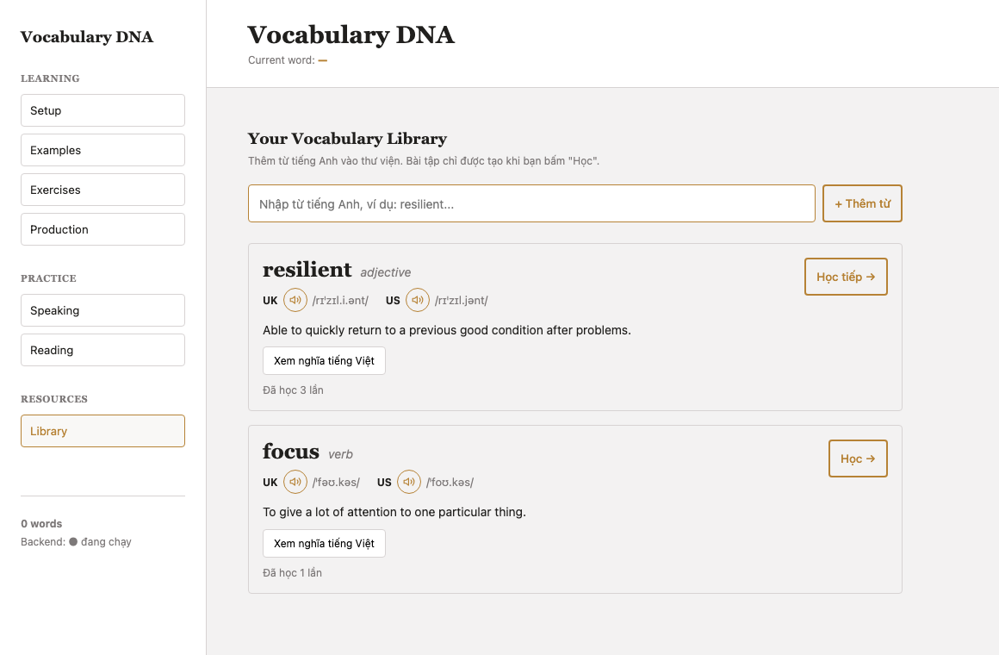

# Vocabulary DNA App

An AI-powered English vocabulary learning app. Build a personal word library with
Cambridge-style dictionary entries (pronunciation, audio, and definition), then decode
each word's **"DNA"** — its evolution from simple to advanced usage — and practice
reading, speaking, and writing with feedback graded by Google Gemini.

## Tech Stack

- **Frontend:** Vanilla JavaScript in a single `index.html` file — no framework, no build
  step. Custom CSS (serif + gold theme). Library and progress are stored in the browser
  via `localStorage`.
- **Backend:** Python + Flask
- **AI:** Google Gemini API
- **Dictionary:** [Free Dictionary API](https://dictionaryapi.dev) (definitions, IPA, UK/US audio)

## Features

### Vocabulary Library (Cambridge-style)

- Add English words to your library just by typing them — no setup required.
- Each entry shows part of speech, **UK/US pronunciation** (IPA) with **audio** playback,
  and an English definition.
- A **Vietnamese translation** is available per word but **hidden by default** — reveal it
  only when the English definition isn't clear enough.
- Tracks how many times you've studied each word.

### Vocabulary DNA Decoder

- Breaks a word into a progressive "evolution path" of example sentences with matching
  translation exercises, from beginner to advanced.
- Exercises are **generated on demand** — only when you start studying a word — and extra
  levels can be unlocked as you progress.

### Practice

- **AI reading passages** built around the words in your library.
- **Speaking practice** — AI-generated prompts, model answers, and grading of your response.
- **Sentence evaluation** — grades your own sentences for correctness and style, with
  polished native-level suggestions.

## Architecture

The app is split into two independent parts:

- **Frontend** (`index.html`) — a static, single-file vanilla-JS app with no build step.
  It only talks to the backend over HTTP; it never touches the Gemini API or any secret.
- **Backend** (`backend/app.py`) — a Flask API that holds the `GEMINI_API_KEY` in an
  environment variable (loaded from `backend/.env`, which is gitignored) and proxies all
  AI requests to Gemini. It also serves dictionary lookups via the Free Dictionary API,
  with a Gemini fallback for words the dictionary doesn't cover.

Keeping the key server-side means it never appears in browser code, client network
responses, or version control — avoiding the key-leakage risk common in frontend-only AI demos.

```
Browser (index.html) --HTTP--> Flask backend (backend/app.py) --HTTPS--> Google Gemini API
                                       |
                                       +----------HTTPS---------> Free Dictionary API
                                       ^
                                       |
                                GEMINI_API_KEY (.env, not committed)
```

### Backend API endpoints

| Endpoint | Purpose |
| --- | --- |
| `GET  /api/health` | Health check |
| `POST /api/define` | Dictionary lookup: definition, IPA, UK/US audio + Vietnamese translation |
| `POST /api/decode-dna` | Generate the evolution path + exercises for a word |
| `POST /api/extra-dna` | Generate additional levels/exercises |
| `POST /api/reading-passage` | Generate a reading passage from chosen words |
| `POST /api/speaking-question` | Generate a speaking prompt |
| `POST /api/speaking-model-answer` | Generate a model answer |
| `POST /api/speaking-check` | Check a spoken/typed answer against the model |
| `POST /api/evaluate-sentence` | Grade a user-written sentence |

## Getting Started / Run Locally

### Prerequisites

- Python 3.9+
- A Google Gemini API key ([Google AI Studio](https://aistudio.google.com/))

### 1. Set up the backend

```bash
cd backend
python3 -m venv .venv
source .venv/bin/activate   # Windows: .venv\Scripts\activate
pip install -r requirements.txt
```

### 2. Configure your API key

```bash
cp .env.example .env
```

Then open `backend/.env` and set your real key:

```
GEMINI_API_KEY=your_gemini_api_key_here
```

### 3. Run the backend

```bash
python app.py
```

The API will start on `http://127.0.0.1:5000`.

> **Port 5000 already in use?** On macOS it's often taken by AirPlay Receiver. Start on a
> different port with `PORT=5001 python app.py` — and update the `API` constant near the top
> of the `<script>` block in `index.html` to match (e.g. `const API = 'http://127.0.0.1:5001';`).

### 4. Open the frontend

Open `index.html` directly in your browser. It talks to the backend at
`http://127.0.0.1:5000` and stores your library and progress in the browser's `localStorage`.

## Screenshots



