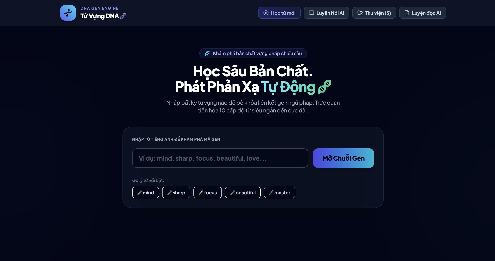

# Vocabulary DNA App

An AI-powered English vocabulary learning app that decodes the "DNA" of a word — its evolution from simple to advanced usage — and lets learners practice reading, speaking, and writing with feedback graded by Google Gemini.

## Tech Stack

- **Frontend:** React (via CDN, no build step) + Tailwind CSS
- **Backend:** Python + Flask
- **AI:** Google Gemini API

## Features

- **Vocabulary DNA Decoder** — breaks down a word into a progressive "evolution path" of example sentences and matching translation exercises, from beginner to advanced.
- **AI-Generated Reading Passages** — generates short reading passages built around the learner's chosen vocabulary.
- **Speaking Practice & AI Grading** — generates speaking prompts, model answers, and checks the learner's spoken/typed response against them.
- **Sentence Evaluation** — grades user-written sentences for correctness and style, with polished native-level suggestions.
- **Progressive Level Unlocking** — unlocks additional evolution levels and exercises as the learner advances.

## Architecture

The app is split into two independent parts:

- **Frontend** (`index.html`) — a static, single-file React app with no build step. It only talks to the backend over HTTP; it never touches the Gemini API or any secret.
- **Backend** (`backend/`) — a Flask API that holds the `GEMINI_API_KEY` in an environment variable (loaded from `backend/.env`, which is gitignored) and proxies all AI requests to Gemini.

This separation keeps the API key off the client entirely — it never appears in browser code, network responses to the client, or version control, which avoids the key leakage risk common in frontend-only AI demos.

```
Browser (index.html) --HTTP--> Flask backend (backend/app.py) --HTTPS--> Google Gemini API
                                        ^
                                        |
                                 GEMINI_API_KEY (.env, not committed)
```

## Getting Started / Run Locally

### Prerequisites

- Python 3.9+
- A Google Gemini API key ([Google AI Studio](https://aistudio.google.com/))

### 1. Set up the backend

```bash
cd backend
python3 -m venv .venv
source .venv/bin/activate   # Windows: .venv\Scripts\activate
pip install -r requirements.txt
```

### 2. Configure your API key

```bash
cp .env.example .env
```

Then open `backend/.env` and set your real key:

```
GEMINI_API_KEY=your_gemini_api_key_here
```

### 3. Run the backend

```bash
python app.py
```

The API will start on `http://127.0.0.1:5000`.

### 4. Open the frontend

Open `index.html` directly in your browser (it talks to the backend at `http://127.0.0.1:5000`).

## Demo

_Coming soon._

## Screenshots


